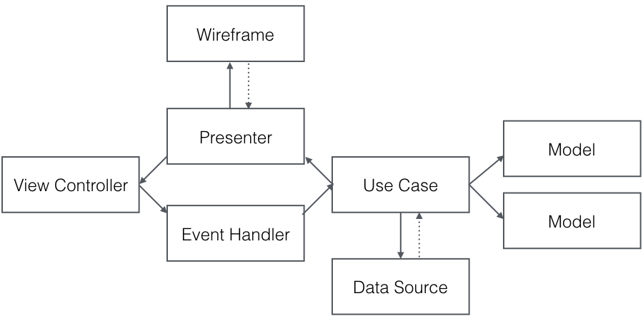

VIPER-SWIFT
===========

A fork of the example app which accompanies the [objc.io VIPER architecture article](https://www.objc.io/issues/13-architecture/viper/), extracting responsibility for event handling from the presenter to a standalone event handler.

This modification to the app is intended to reduce the size of the presenter, and give it a smaller set of responsibilities; i.e rather than handling view interaction events _and_ presenting list items and interfaces, it should just do the latter with the event handler being responsible for the former.

